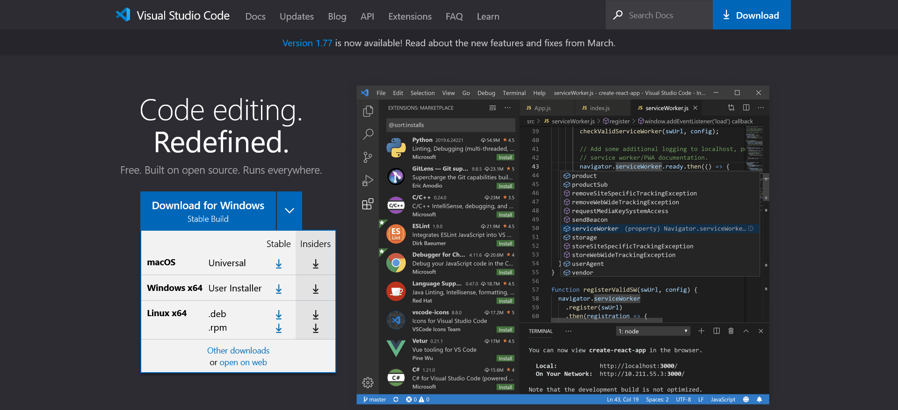
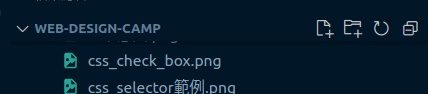

# 安裝VS Code

---

# 下載並安裝

---

# 安裝擴充套件

快捷鍵: `Ctrl+Shift+X` 或是 `Ctrl+Shift+P` 之後輸入 `ext install`

搜尋
* 繁體中文語言包
* Markdown All in One
* Live Server
* indent-rainbow

並且安裝

---

## 建立資料夾

到檔案總管(`Ctrl`+`E`)中建立一個資料夾，並且將資料夾拖曳到VS Code中。或是點擊開啟資料夾。

## 建立檔案
左道右分別是建立檔案，建立資料夾，重新整理，和折疊資料夾
。
