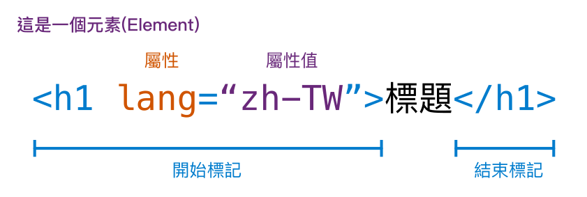

<style>
marp-pre{
     border-radius: 13px;
}
code{
    border-radius: 7px;
}
</style>

# HTML
講師：

---

# 第一個網站

打開VSCode開啟一個資料夾，建立一個檔案叫做`index.html`
（當然要取別的名字也可以）並在裡面隨便打點字
我們到檔案總管找到這個檔案並打開，你的第一個網頁完成了

> *網站講白就是一個要用瀏覽器打開的Word檔*

但是只有純文字太無聊了，所以我們在文字間做一些標記讓他們有不一樣的意義

---
<!--_class: lead-->
# HTML
超文本標記語言 HyperText Markup Language
網站的骨架


---


# 元素
網站所有東西都是由元素組成


---

# 文字

```html
<p>段落
  <b>粗體</b>
  <i>斜體</i>
  <s>刪除線</s>
  <u>底線</u>
  H<sup>+</sup>
CO<sub>2</sub>
</p>
```

**粗體**
*斜體*
~~刪除線~~
<u>底線</u>
  H<sup>+</sup> CO<sub>2</sub>

---
# 空白 換行

在HTML當中一個以上的空白都會被視為一ㄅㄨㄞˊ都會被視為一個空白

---
# 插入

```html
橫線<hr />
換行<br />這兩個是插入一個元素而不是指定範圍，因此習慣後面會用/>結尾。但你要打<br>瀏覽器也看得懂
```
橫線
<hr>
換行<br />這兩個是插入一個元素而不是指定範圍，因此習慣後面會用/>結尾。但你要打<br>瀏覽器也看得懂

---

# 標題

```html
<h1>H1</h1>
<h2>H2</h2>
<h3>H3</h3>
<h4>H4</h4>
<h5>H5</h5>
<h6>H6</h6>
```

# H1

## H2

### H3

#### H4

##### H5

###### H6

---
# 無序清單

```html
<ul>
  <li>a</li>
  <li>b</li>
  <li>c</li>
</ul>
```

+ a
+ b
+ c
  
---

# 有序清單

```html
<ol>
  <li>a</li>
  <li>b</li>
  <li>c</li>
</ol>
```

1. a
3. b
2. c
  
---

# 清單裡可以有清單

```html
<ul>
  <li>清單裡可以有清單</li>
  <ul>
    <li>沒錯</li>
    <li>就是這樣</li>
  </ul>
</ul>
```

+ 清單裡可以有清單
  + 沒錯
  + 就是這樣

---

# 超連結
### 格式

```html
<a href="連結">顯示文字</a>
```
### 範例
```html
<a herf="https://www.google.com">Goolge</a>
```

[Google](https://www.google.com)

---

# 圖片
### 格式
```html

```

### 範例

```html

```


---


# 表格

```html
<table>
  <tr>
    <td>1</td>
    <td>2</td>
  </tr>
  <tr>
    <td>3</td>
    <td>4</td>
  </tr>
```


---

# 輸入

```html
<input type="number" />
```


---

# 基本架構

```html
<!DOCTYPE html>
<html lang="zh-tw">
<head>
  <meta charset="UTF-8">
  <meta http-equiv="X-UA-Compatible" content="IE=edge">
  <meta name="viewport" content="width=device-width, initial-scale=1.0">
  <title>Document</title><!--標題-->
</head>
<body>
  
</body>
</html>
```