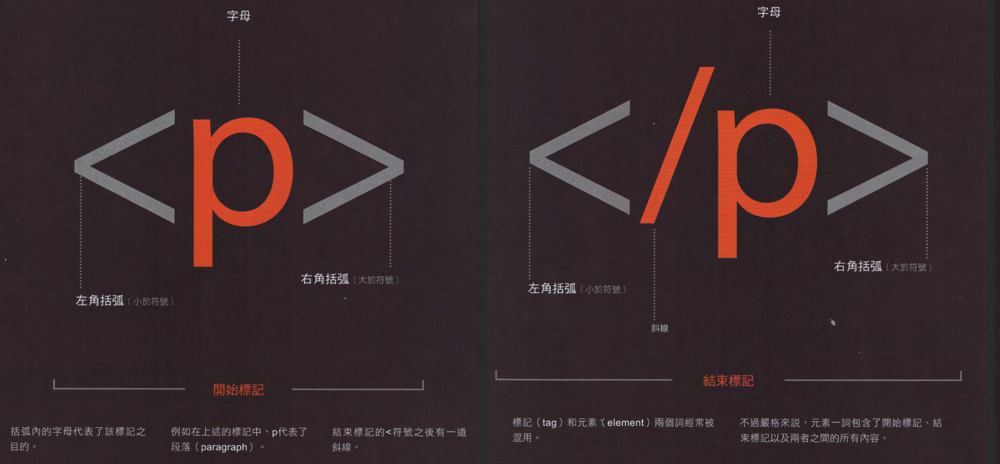
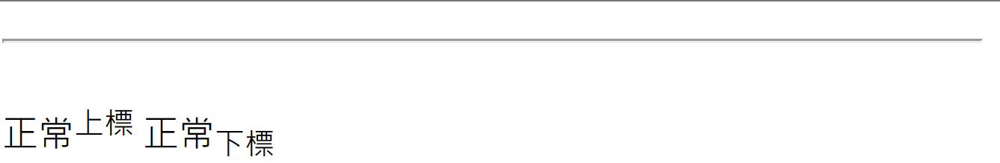

<style>
marp-pre{
     border-radius: 13px;
}
code{
    border-radius: 7px;
}
</style>

# HTML

---

# 元素


---

```html
<元素名稱></元素名稱>
<元素名稱 屬性名稱="屬性值"></元素名稱>
<元素名稱 屬性名稱="屬性值" 屬性名稱="屬性值"></元素名稱>
```

---

# 文字

```html
<p>段落</p>
<b>粗體</b>
<i>斜體</i>
<s>刪除線</s>
<u>底線</u>
```

**粗體**
*斜體*
~~刪除線~~


---

```html
<hr />
<br />
正常<sup>上標</sup>
正常<sub>下標</sub>
```



---

# 表格

```html
<table>
  <tr>
    <td>1</td>
    <td>2</td>
  </tr>
  <tr>
    <td>3</td>
    <td>4</td>
  </tr>
```


---

# 輸入

```html
<input type="number" />
```


---

# 其他

# 基本架構

```html
<!DOCTYPE html>
<html lang="zh-tw">
<head>
  <meta charset="UTF-8">
  <meta http-equiv="X-UA-Compatible" content="IE=edge">
  <meta name="viewport" content="width=device-width, initial-scale=1.0">
  <title>Document</title><!--標題-->
</head>
<body>
  
</body>
</html>
```

---

# 標題

```html
<h1>H1</h1>
<h2>H2</h2>
<h3>H3</h3>
<h4>H4</h4>
<h5>H5</h5>
<h6>H6</h6>
```

---

# H1

## H2

### H3

#### H4

##### H5

###### H6

---

# 無序清單

```html
<ul>
  <li>a</li>
  <ul>
    <li>b</li>
    <li>c</li>
  </ul>
</ul>
```

+ a
  + b
  + c

---

# 有序清單

```html
<ol>
  <li>a</li>
  <ol>
    <li>b</li>
  </ol>
</ol>
```


---

# 超連結

```html
<a href=來源>顯示文字</a>
<a herf=https://www.google.com>Goolge</a>
```

[Google](https://www.google.com)

---

# 圖片

```html


```


