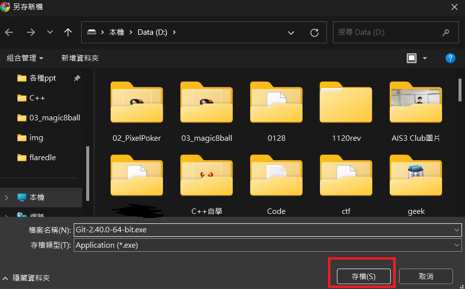

<style>
marp-pre{
     border-radius: 13px;
}
code{
    border-radius: 7px;
}
</style>

# Git/Github
## 講師：陳邱嵩
---


#### Git
* 版本控制系統
* 為了處理修改檔案時的問題
* 每次上傳、下載時會比較差異，只傳送有變動的檔案
    * 節省時間

#### Github
* 檔案儲存處
* 程式的雲端硬碟、IG
* 工程師必備神器!!!
<!-- Github物流中心、程式碼的FB、IG，可以在上面找到許多厲害的工具、和別人分享自己的Code
     Git是幹嘛的?Git是為了解決每次要更新檔案的時候，要先複製、貼上一個新的檔案，就算你把檔案名稱改掉了你也很難發現出更改的地方，Git就是要解決這問題
     Git就是把包裹寄到Github的交通方式
     Git在傳送包裹的時候只會傳送不同的地方
     節省時間-->
---

<!-- _class: lead -->


---

<!-- _class: lead -->
# 安裝流程

---


---


---



---


---

1. 按下鍵盤上Windows
2. 打出cmd，並按`Enter`
3. 逐行貼上以下指令
```bash
git config --global user.name "<使用者名字>"
git config --global user.email "<電子信箱>"
```
舉例：
```bash
git config --global user.name "abcd"
git config --global user.email "abcd@gmail.com"
```