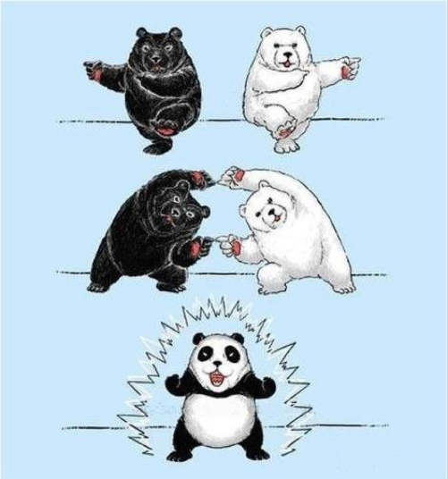

# 進階CSS
講師: 毛哥EM

---
<!-- _class: lead -->
# display

中文：顯示

---
# display
`display: inline;` - 行內元素
`display: block;` - 區塊元素
`display: inline-block;` - 行內但保留區塊元素特性
`display: none;` - 變不見(且不站原本空間)

如果使用 inline-block(像是 a 或 li 設定)，標籤之間會有空白字元約 4~5px

---

# display:flex;


---

## Flex 外容器屬性

* display
* flex-flow
* flex-direction
* flex-wrap
* justify-content
* align-items

---

# flex-direction

怎麼排

左到右、右到左、上到下、下到上。


```css
.flex-container {
    flex-direction: row;
    row-reverse;
    column;
    column-reverse;
}
```
---

# flex-wrap
超出範圍是否換行

換行、不換行、換行時反轉。


```css
.flex-container {
  flex-wrap: nowrap | wrap | wrap-reverse;
}
```


---

# flex-flow

懶人縮寫

```css
.flex-container {
  flex-flow: <‘flex-direction’> <‘flex-wrap’>
}
```



---

# justify-content

水平對齊

```css
.flex-container {
  justify-content: flex-start | flex-end | center | space-between | space-around;
}
```


---

# align-items

垂直對齊

```css
.flex-container {
  align-items: flex-start | flex-end | center | baseline | stretch;
}
```


——

# align-content

```css
flex-container {
  align-content: flex-start | flex-end | center | space-between | space-around | stretch;
}
```


---
<!--_class: lead-->
# [送青蛙回家吧](https://flexboxfroggy.com/#zh-tw)

---

# Position
物件定位時所要的參考對像

```css 
position:static | relative | absolute | fixed | sticky;
top | right | bottom | left: 10px;
```

---

### static 原始定位
inline往右，block往下

---

### reletive 相對定位
我原本該在哪裡位置就佔著，但我看起來要往右/下...。


---

### absolute 絕對定位
貼到最近的reletive祖先元素。口決:父相子絕

---

## fixed
貼著視窗，卡在那裡，原本位置不再佔據

## sticky
以自己為基準，卡在那裡，但sticky元素仍然in flow，元素佔位會保留


---

# Transform: translate
```css
transform: translate(單位或百分比, 單位或百分比);
transform: translateX(單位或百分比);
transform: translateY(單位或百分比);
```

單位值為多少就平移多少，然後transform支援負值

---

```css
.translate {
  background-color: pink;
  transform: translate(100px, -50px);
}
```


---

translate的百分比基準是自己的width跟height


——
來一個推方塊範例
```css
.outer  {
  position: relative;
}

img {
  position: absolute;
  top:50%;
  left: 50%;
}
```


---

再來往左上推: `transform: translate(-50%, -50%);`


---