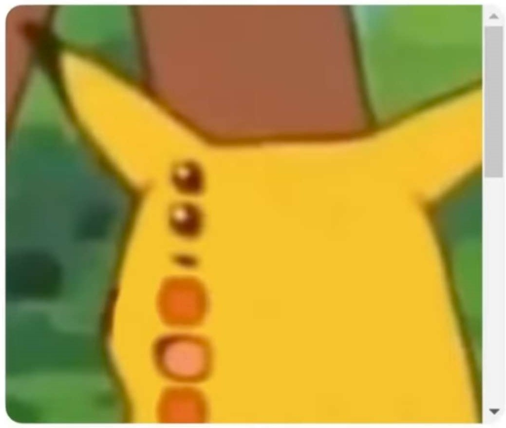
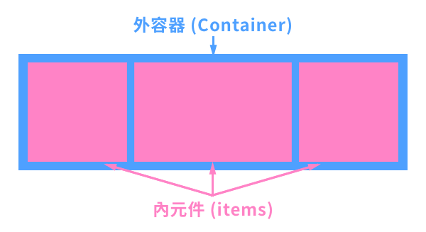
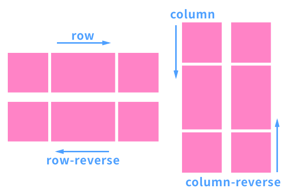
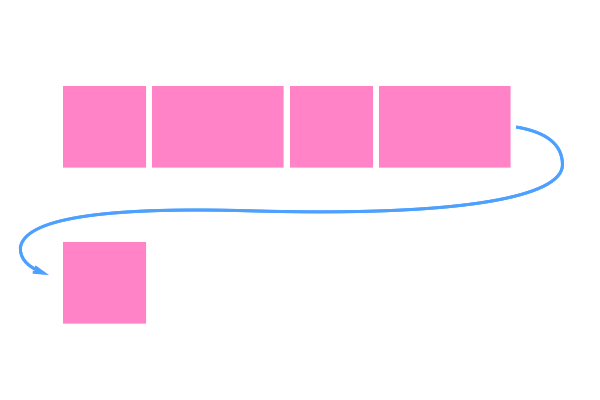
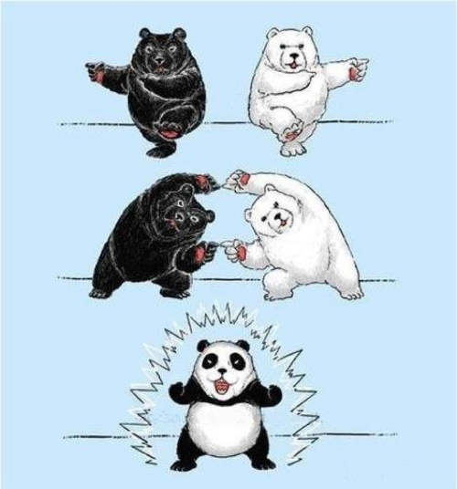
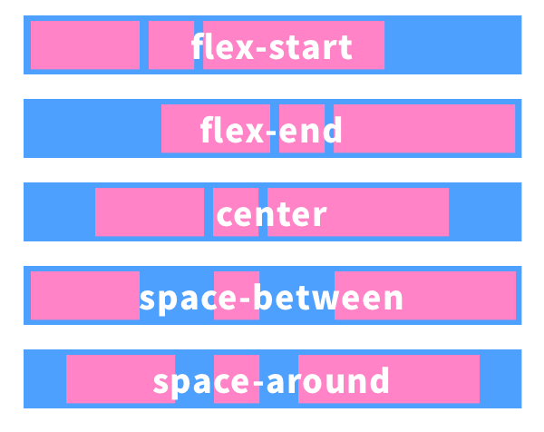
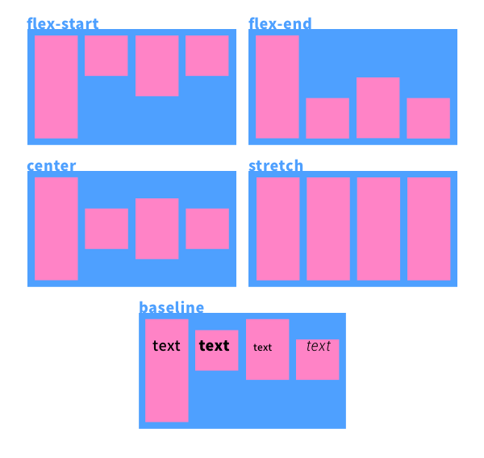
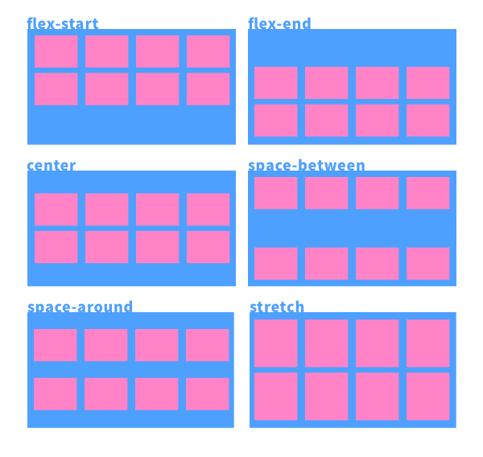

<style>
marp-pre{
     border-radius: 13px;
     padding:0.8rem;
}
code{
    border-radius: 7px;
}
</style>

# 進階CSS
講師: 毛哥EM

---

# 選擇器

CSS可以用來控制元素，但要先用選擇器來選擇要誰控制

所有後代: `*`
後代選擇器: `nav a`
群組選擇器: `nav, a`
親代選擇器: `ol > li` (只能在裡面一層)
相鄰兄弟: `h1 + p`(後面的第一個)
一般兄弟: `h1 ~ p`(後面的)
屬性選擇器: `input[type="text"]`

---

# 權重
你媽說你很醜，早餐店阿姨說你是帥哥，你就是醜，因為你媽權重比較重。  

從上比下來。這裡有一個計算機

    !important
    ID 選擇器
    類別選擇器、屬性選擇器、偽類選擇器(如:root)
    元素選擇器、偽元素選擇器
    任何元素選擇符*沒有權級
```
<!-- _class: lead -->
# display

中文：顯示

---
# display
`display: inline;` - 行內元素
`display: block;` - 區塊元素
`display: inline-block;` - 行內但保留區塊元素特性
`display: none;` - 變不見(且不佔原本空間)



---

# display:flex;




---

## Flex 外容器屬性

* display
* flex-flow
* flex-direction
* flex-wrap
* justify-content
* align-items

---

# flex-direction

怎麼排
左到右、右到左、上到下、下到上


```css
.flex-container {
    flex-direction: row;
    row-reverse;
    column;
    column-reverse;
}
```
---

# flex-wrap
超出範圍是否換行

換行、不換行、換行時反轉。


```css
.flex-container {
  flex-wrap: nowrap;
  flex-wrap: wrap;
  flex-wrap: wrap-reverse;
}
```



---

# flex-flow

<!-- _backgroundColor: #cce8fd -->
<!-- _backgroundImage: none -->

懶人縮寫

```css
.flex-container {
  flex-flow: 方向 換行;
}
```



---

# justify-content

水平對齊

```css
.flex-container {
  justify-content: flex-start;
  justify-content: flex-end;
  justify-content: center;
  justify-content: space-between;
  justify-content: space-around;
}
```



---

# align-items

垂直對齊

```css
.flex-container {
  align-items: flex-start;
  align-items: flex-end;
  align-items: center;
  align-items: baseline;
  align-items: stretch;
}
```



---

# align-content
整體對齊
```css
flex-container {
  align-content: flex-start;
  align-content: flex-end;
  align-content: center;
  align-content: space-between;
  align-content: space-around;
  align-content: stretch;
}
```



---

<!--_class: lead-->
<!--_backgroundColor: #1f5768-->
<!-- _backgroundImage: none -->

  [
  <span style="color:#FFF;font-size:3rem;">送青蛙回家吧</span>](https://flexboxfroggy.com/#zh-tw)

---

# Position
物件定位時所要的參考對像

```css 
position:static | relative | absolute | fixed | sticky;
top:10px;
right:10px;
bottom:10px;
left:10px;

```

---

### static 原始定位

正常預設情況
inline往右，block往下


---

### reletive 相對定位


---

### absolute 絕對定位
貼到最近的reletive祖先元素。

> 口訣:父相子絕
```css
.parent {
  position: relative;
}
.child {
  position: absolute;
  left:50%;
}
```

---

## fixed
貼著視窗，卡在那裡，原本位置不再佔據

## sticky
以自己為基準，卡在那裡，但sticky元素仍然in flow，元素佔位會保留


---

# Transform: translate

平移元素

```css
transform: translate(單位或百分比, 單位或百分比);
transform: translateX(單位或百分比);
transform: translateY(單位或百分比);
```

單位值為多少就平移多少，transform支援負值

---

```css
.translate {
  background-color: pink;
  transform: translate(100px, -50px);
}
```
<!-- class: lead -->


---

translate的百分比基準是自己的width跟height

來一個推方塊範例
```css
.outer  {
  position: relative;
}

img {
  position: absolute;
  top:50%;
  left: 50%;
}
```


---

再來往左上推: `transform: translate(-50%, -50%);`


---

# 來快樂排版吧
網頁設計幾乎所有時間都花在這裡
很多問題沒有標準做法
多多練習就會找到自己習慣的方式