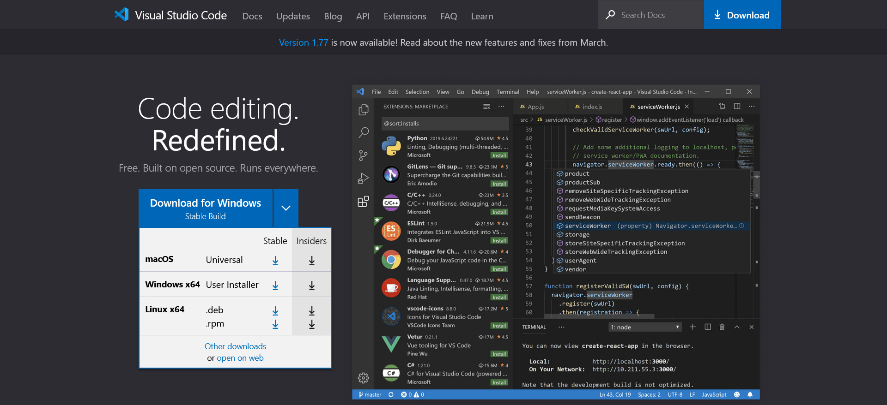

<style>
marp-pre{
     border-radius: 13px;
}
code{
    border-radius: 7px;
}
</style>


# **網頁設計營隊**
西苑高中資訊志工

---
<!-- _class: lead -->
# 關於我
毛宥鈞 (毛哥EM)
獸控 | 數位創作者 | Web開發人員

Musixmatch管理員


---

## 第一天 流程
* 介紹網頁原理
* VS Code
* Markdown
* 基本HTML
* 基本CSS
* Git/Github
* 進階CSS

---

## 第二天 流程

* 複習HTML/CSS
* JavaScript介紹
* 後端Google App Script
* 專案製作
* Q&A 補充、發證書
* 
---

<!-- _class: lead -->
# 網頁原理

---


---

1. 瀏覽器去 DNS (電話簿)查 IP 地址
2. 瀏覽器向伺服器傳送 HTTP 請求網站資料
   * 交通規則 - HTTPS、FTP
   * 交通工具 - GET
3. 伺服器回傳回應
   * 狀態(如200 OK, 404 Not Found)
      * [各種 HTTP 狀態碼介紹](https://http.cat/)
   * 檔案(如HTML, CSS, JS, JPG, PNG)
4. 瀏覽器把一小塊一小塊的東西(封包)，組合成完整的網站，並把它呈現起來

<!-- 訪問網站猶如寄送包裹
     包裹就是檔案
     透過哪條路：網路
     地址=ip位置，ip太醜改成有意義的名字=>Domain
     交通規則：tcp底下的http(網頁常用)
     交通工具：GET、POST   
 -->
---

<!-- _class: lead -->
# IP Adress & DNS

---

1. IP
* 當連上網路後，每台電腦在網路中的位置
   * IPv4、IPv6
      * Google: 172.217.160.110 / 2404:6800:4012:1::200e
2. DNS
* 把IP變成一串有意義的文字(~~一坨數字根本記不住~~
   * 可以申請自己的網域

---

<!-- _class: lead -->
# HTTP Request & Response

---

##### HTTP是一種通訊協定，主要用來傳輸網頁的資料
* 分成兩種
   * Request & Response，皆有Header跟Body兩部分
      * Header放一些額外資訊，如: Host、User-Agent
      * Body放主要內容:  HTML、CSS、JS
      * 由瀏覽器解析，渲染成可讀的網頁
* Request
   * 向伺服器請求資料
* Response
   * 伺服器傳回資料

---

# 安裝VS Code

---
# 下載並安裝


---

# 登入
登入你的Microsoft帳號，並且安裝你想要的擴充套件

---
<!-- _class: lead -->
# Markdown
西苑高中網頁設計營隊
講師:魏均翰

---

# Markdown簡介
## Markdown的目標：「易讀易寫」
<!-- 是個純文字的語法
當然也可以在裡面寫HTML語法
只是可能會有些問題而且和原本初衷不符 -->

---

標題
===

有兩種(副)標題的語法
<!-- Setext和atx形式 -->
## Setext形式
橫線任何數量都可以
```md
標題
===
副標
---
```

---

## atx形式(推薦)

```md
# H1
## H2
### H3
#### H4
##### H5
###### H6
```
---

## 字體效果

```md
*斜體字*
**粗體字**
***斜粗體***
~~刪除線~~
_斜體2_
__斜粗2__
```
---
<!-- _class:  -->
# 換行

行末按兩個空格  
産生斷行,否則再多換行都會變成一行  

不同種元素間可以保持換行，減少錯誤，提高可讀性

```md
行末按兩個空格  
産生斷行
,否則再多換行

都會變成一行
```
---

# 分隔線

```
1.
---
2.
***
3.
- - -
4.
* * *
```
---

引文
---

>引言
>>引言中的引言
>>>引言中的引言中的引言


<!-- 我們通常會把用來當便利貼 -->

```md
> 引言
>> 引言中的引言
>>> 引言中的引言中的引言
```

---

# 有序列表

其實數字從1開始後後續數字隨便打數字也會依序出現
1. 數字標號
2. 數字標號
3. 數字標號
```md
1. 數字標號
2. 數字標號
5. 數字標號
(要數字開頭但不想變成項目清單可以加反斜線)
2023/. sysh.
```
---
# 無序清單

不可混用

- 其他標號
- 其他標號
- 其他標號
```md
* 項目清單
- 項目清單
+ 項目清單
```
---

巢狀標號
---
- 無序清單
    - 無序清單子清單
        - 無序清單子子清單

數字標號(有序清單)亦同
```md
- 無序清單

    - 無序清單子清單

        - 無序清單子子清單

```

---

# CheckBox

<input type=checkbox> uncheck
<input type=checkbox checked> check

```md
 - [ ] uncheck
 - [x] check
```
---

超連結
---
>[連結名稱](https://google.com "游標顯示")

```
[連結名稱](https://google.com "游標顯示")
```

---

簡易超連結
---
><https://google.com>
><text@email.com>

```
<https://google.com>
<text@email.com>
```

---

圖片
---


```md


[](連結網址)
/*可以把它當成在超連結裡的文字來理解*/

```

---

表格
---
| 欄位1 | 欄位2 | 欄位3 |
| :---- | ----: | :---: |
| 置左  |  置右 | 置中  |
| $100  |  $100 | $100  |
| $10   |   $10 |  $10  |
| $1    |    $1 |  $1   |

```md
| 欄位1 | 欄位2 | 欄位3 |
| :---- | ----: | :---: |
| 置左  |  置右 | 置中  |
```
---
# 參考資料
- <https://markdown.tw/>
- <https://hackmd.io/@eMP9zQQ0Qt6I8Uqp2Vqy6w/SyiOheL5N/%2FBVqowKshRH246Q7UDyodFA?type=book>
- <https://www.casper.tw/development/2019/11/23/ten-mins-learn-markdown/>